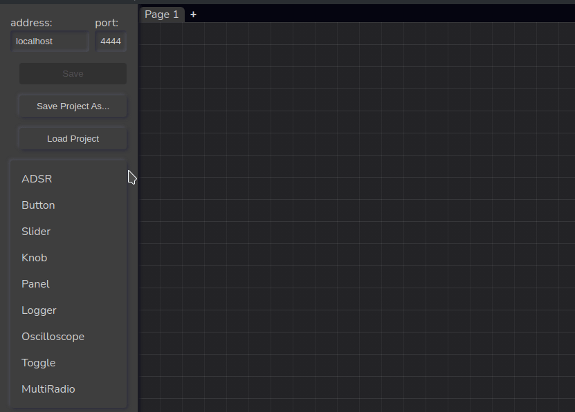

Fast prototype UIs for your favorite audio backend, manage panels, snapshots and talk to the audio engine via OSC messages;  

Features:  
* Growing list of ready-to-use, commonly required elements, such as ADSR panels, transport, wave visualizers, filter and modulation panels . Full list [here](link)
* Comprehensive list of atom like components like knobs, toggles, combo boxes, etc
* Choose color scheme and design concepts for the UI
* Save locally with .json files or log in and keep the work on cloud
* Snapshots for keeping different parameter settings for a panel
* Built in command line tool for lauching the engine and keep things self-contained

Questions:
OSC isn't enough for capturing audio inputs/outputs or sharing large arrays between the audio app and node. Couple of solutions comes to mind using C++ Node.js addons: 
1. Plataform-dependent audio clients with in/out ports (JACK, Asio, etc)
    * that would need dynamic input creation!
2. wrapper for the application, e.g: Pure data => libpd => node-gyp
3. temporary file for array sharing
4. wrap UI-Creator into something VST-like (is it possible?)

